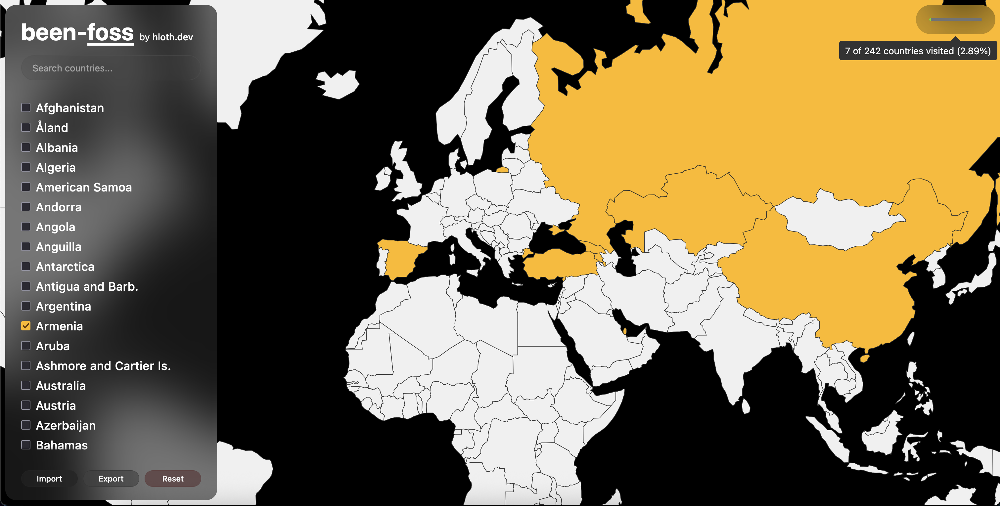

# [been-foss](https://beenfoss.netlify.app)

Visit the website: [beenfoss.netlify.app](https://beenfoss.netlify.app)

Free open source alternative to ad and trackers cluttered "been". It's also much nicer ;)

It has no ads, no trackers whatsover and it's static so maybe I'll add offline support someday. Built with Svelte 5.

## Map issues

I have sourced all data from https://geojson-maps.kyd.au/ so it has some issues regarding countries borders correctness. Some of which include:

- Crimea is incorrectly placed as part of Russia, should be changed to be part of Ukraine

If you have noticed any problems, please open an issue.

## License

[MIT](./LICENSE)

## Donate

[hloth.dev/donate](https://hloth.dev/donate)